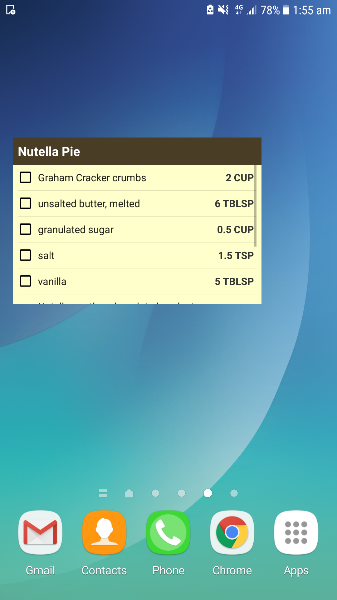

# Baking App
App written for Udacity Android Developer Nanodegree Program

## Table of Contents
* [Project Background](#project-background)
* [Requirements](#requirements)
* [Components Used](#components-used)
* [Project Screenshot](#project-screenshot)
* [Bugs and Feature Requests](#bugs-and-feature-requests)
* [Skill Demonstrated](skill-demonstrated)

## Project Background
Android Baking App that will allow Udacity’s resident baker-in-chief, Miriam, to share her recipes with the world. The app allows a user to select a recipe and see video-guided steps for how to complete it.

## Requirements
- Android Studio 3.1.3
- Build Tools Version 27.1.0
- Minimum Android Version: 15

## Components Used
- Espresso
- Retrofit
- Okhttp
- Dagger
- Exoplayer
- Butterknife
- Android Room Persistence
- View Model
- Viewpager
- [PageIndicatorView](https://github.com/romandanylyk/PageIndicatorView)
- Support design libraries

## Project Screenshot
Home screen. List of recipes

    

Detail screen with ingredients and steps

    
    

Step detail screen with video and fullscreen display for video

    
    

Tablet master detail flow layout

    

Widget

    

## Bugs and Feature Requests
If there is a bug or feature request, please open an [issue](https://github.com/eileenwong9305/BakingApp/pulls).

## Skill Demonstrated
- Use MediaPlayer/Exoplayer to display videos.
- Handle error cases in Android.
- Add a widget to your app experience.
- Leverage a third-party library in your app.
- Use Fragments to create a responsive design that works on phones and tablets.
